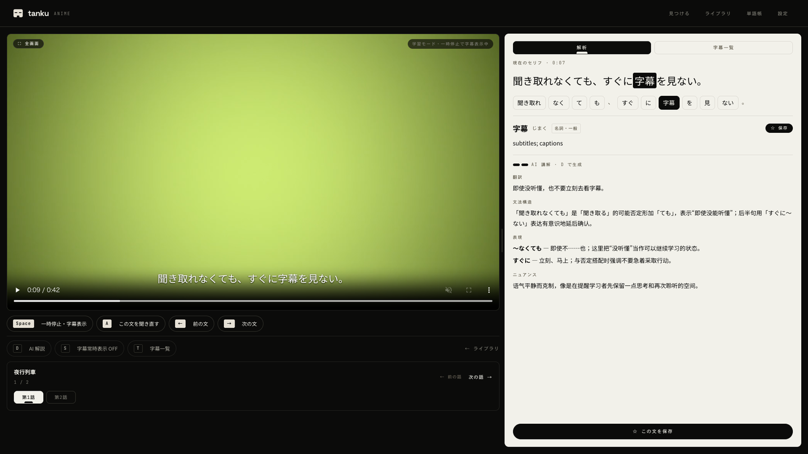
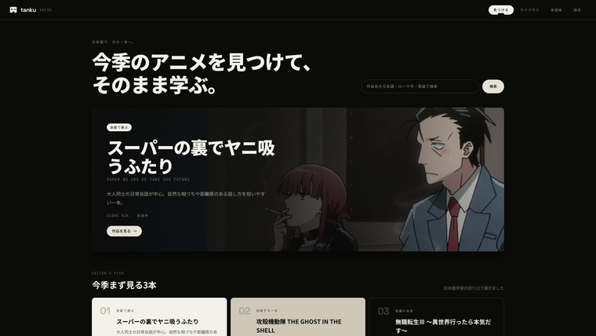
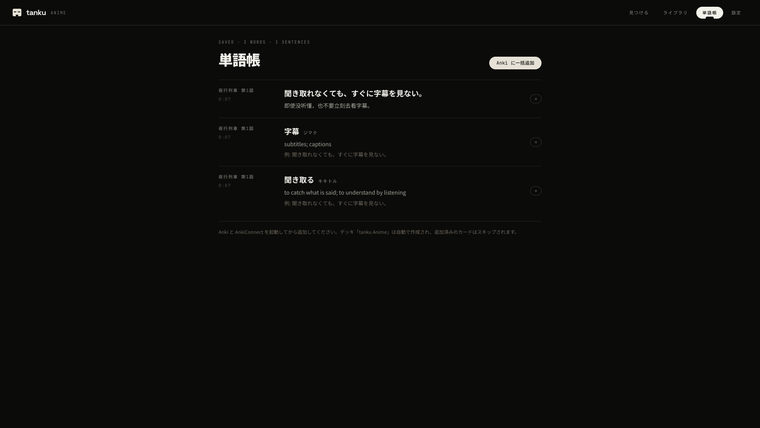

# tanku Anime

[English](README.md) | [简体中文](README.zh-CN.md) | [日本語](README.ja.md)

**A local-first Japanese learning player for anime and Japanese TV drama.** Find a show, watch your own local media with subtitles hidden by default, then pause on the line you missed to analyse it, look up words, get an AI explanation, and save it for review.

> 中文：一个本地优先的日语学习播放器，覆盖动画与日剧。先听、再暂停看当前句、分词查词和按需 AI 讲解，最后保存到生词本复习。

## Install

One command. No git, Node.js, or FFmpeg needed beforehand.

macOS — open Terminal (`⌘ + Space`, type `Terminal`) and paste:

```bash
curl -fsSL https://raw.githubusercontent.com/DanielDcool/tankuanime/master/scripts/install.sh | bash
```

Windows — press `Win + R`, type `powershell`, press Enter, then paste:

```powershell
irm https://raw.githubusercontent.com/DanielDcool/tankuanime/master/scripts/install.ps1 | iex
```

When it finishes, the app starts and your browser opens. From then on, **double-click the tanku Anime shortcut on your Desktop** to start it. Run the same command again to update. Prefer git? See [Manual setup](#manual-setup).

<details>
<summary>What the installer does</summary>

- Installs into `~/tankuanime` and keeps everything it downloads inside that folder: the source, a private Node.js 22 (official nodejs.org build, SHA-256 verified), and FFmpeg. No administrator rights; your system `PATH` and shell profile are not touched. If a Node.js 22 or FFmpeg is already on your `PATH`, it uses that instead.
- FFmpeg comes from the builds linked on ffmpeg.org: on macOS without Homebrew, the static build from [evermeet.cx](https://evermeet.cx/ffmpeg/) (Intel binaries, run through Rosetta 2 on Apple Silicon); on Windows, the [gyan.dev](https://www.gyan.dev/ffmpeg/builds/) essentials build.
- Also fetches the Japanese dictionary (JMdict), runs `npm ci`, and puts a **tanku Anime** shortcut on your Desktop. Uninstall = delete the folder and the shortcut.
- Windows: the installer and launcher run in CI on every push, but have not yet been tried on a physical Windows machine — reports welcome.

</details>



*Paused on the line you missed. The sentence is tokenized, the word you click shows its reading and JMdict entry, and the optional AI breakdown covers translation, grammar, phrasing, and tone.*

| Find something to watch | Review what you saved |
| --- | --- |
|  |  |

*Screenshots use the bundled demo media, not copyrighted video.*

tanku Anime is an early-stage, self-hosted web app. Your media files stay on your computer; the app does not host, proxy, or download video.

## What you can do

- Discover both anime and Japanese drama: browse the current and previous anime season, open the drama picks that ship with the app, search titles, and open official streaming or information links.
- Switch between **アニメ** (anime) and **ドラマ** (Japanese TV drama) from the top navigation. The whole site inverts with the mode — anime is ink-black with bone-white text, drama is the other way round — while the player page stays ink-black in both modes, so no large bright surface sits next to the video except the analysis panel.
- Start with drama without configuring anything: a hand-written pick list of Japanese dramas ships with the app, graded by listening difficulty, each with a short reason it is useful for learning, such as workplace keigo or everyday conversation.
- Search any other Japanese drama by title (Japanese or romaji) — results come as poster cards with a rating, episode count, network, and synopsis from Bangumi, no token required. A **もっと探す** button under the cards runs the same keyword straight against Nyaa when the catalog has nothing.
- Learn from local `.mp4` / `.mkv` files with Japanese `.srt` / `.ass` subtitles. MKV files are remuxed when needed for browser playback.
- Keep larger libraries readable: media is grouped by its containing folder, and each folder can be collapsed independently.
- Switch episodes from the player: it lists playable videos in the same folder with previous, next, and direct episode links.
- Stay in listening mode by default: pause to reveal the current line, replay it, jump between lines, or open a transcript that follows playback.
- Tokenize Japanese locally with Kuromoji and look up JMdict definitions.
- Ask Anthropic, DeepSeek, OpenAI, or Google Gemini for a structured explanation only when you want one. Results are cached locally.
- Save words and sentences, inspect their meaning, cached AI explanation, and timestamped source, then send them to a `tanku Anime` Anki deck with one click. Existing cards are skipped.
- Optionally connect to Jimaku for subtitle matching, and hand a magnet link to your own local downloader. Jimaku matching searches both its anime and live-action libraries, so drama subtitles go through the same one-time manual match, and drama resource search uses Nyaa's Live Action category with raw releases as the default. No downloader RPC, video transfer, or remote media lifecycle is built into the app.

## Manual setup

For developers, or if you would rather use your own git checkout, Node.js, and FFmpeg.

**Requirements:** Node.js 22.x and FFmpeg, with both `ffmpeg` and `ffprobe` available on `PATH`. macOS is fully verified with real media; on Windows, install and startup are verified but media playback on physical hardware is not yet confirmed.

macOS:

```bash
git clone https://github.com/DanielDcool/tankuanime.git
cd tankuanime
brew install ffmpeg
npm ci
npm start
```

Windows PowerShell (after installing [Node.js 22](https://nodejs.org/en/download) and an FFmpeg Windows build linked from the [official FFmpeg download page](https://ffmpeg.org/download.html)):

```powershell
node --version
ffmpeg -version
ffprobe -version
git clone https://github.com/DanielDcool/tankuanime.git
cd tankuanime
npm ci
npm start
```

`node --version` must report `v22.x`. Do not use a moving Node.js "LTS" package alias unless it still resolves to major version 22.

`npm start` runs a quick environment check first: it stops with install guidance when the Node.js major version is not 22, and prints a warning (while still starting) when `ffmpeg` or `ffprobe` is missing from `PATH`. Set `TANKU_OPEN_BROWSER=1` to have it open the browser once the page is ready — this is what the double-click launchers do.

## First run

Open [http://localhost:5173](http://localhost:5173). The application creates its local database automatically and watches the `AnimeLibrary` folder in your home directory by default. You can edit the full path in **Settings**; restart the application after saving it.

When the library is empty, the page walks through choosing a media folder, adding the first video, and optionally adding subtitles. Local playback needs no API key; AI explanations and Jimaku can be configured later.

`MEDIA_DIR` remains the highest-priority process override. To use a temporary media override or a different data location on macOS or Linux, set these before starting:

```bash
export MEDIA_DIR="$HOME/Movies/TankuAnime"
export DATA_DIR="$PWD/.local-data"
npm start
```

On Windows PowerShell, use process-local environment variables:

```powershell
$env:MEDIA_DIR = "$HOME\Videos\TankuAnime"
$env:DATA_DIR = "$PWD\.local-data"
npm start
```

## Optional setup

### Japanese dictionary

For local word definitions, run (the one-line installer already does this):

```bash
npm run setup:jmdict
```

This downloads a verified [JMdict Simplified](https://github.com/scriptin/jmdict-simplified) release (CC BY-SA 4.0; JMdict is the property of the [EDRDG](https://www.edrdg.org/)), extracts it, and imports it into the local database. Pass `-- --latest` for the newest release or `-- --force` to re-download.

If the automatic download is unavailable, download a `jmdict-eng-*.json.zip` release from [JMdict Simplified releases](https://github.com/scriptin/jmdict-simplified/releases) manually, extract it to `server/vendor/jmdict-eng.json`, then run `npm run import-jmdict -w server`.

### One-click Anki export

Install [AnkiConnect](https://git.sr.ht/~foosoft/anki-connect) in Anki with add-on code `2055492159`, restart Anki, and keep it running. On the vocabulary page, click **Anki に一括追加**. tanku Anime creates a `tanku Anime` deck and note type, sends only new cards, and includes the saved context and timestamped local playback link on the back.

The integration talks only to AnkiConnect on `127.0.0.1:8765`; it never edits Anki's collection database directly. If Anki or AnkiConnect is unavailable, the vocabulary stays unchanged and the page shows the required setup.

New cards use `APP_BASE_URL` (default: `http://localhost:5173`) for playback links. Existing cards that are skipped by duplicate detection are not rewritten automatically.

### AI explanations

In **設定 / Settings**, choose Anthropic, DeepSeek, OpenAI, or Google Gemini and enter that provider's API key. Keys and explanation cache are stored only in the local SQLite database; do not commit keys or the `server/data/` directory.

Explanations are written in Chinese or English. By default the language follows your browser / OS language (Chinese for `zh-*`, otherwise English); you can pin either language under **AI 解説の言語** in Settings.

OpenAI requires an [OpenAI Platform API key](https://platform.openai.com/api-keys). A ChatGPT or Codex subscription by itself is not an API key.

### Drama search (Bangumi)

Drama mode needs no token at all. The home page is the built-in pick list; the search box looks titles up on [Bangumi](https://bgm.tv/) (`api.bgm.tv`, public and keyless) and shows Japanese TV dramas only — movies, variety shows, and non-Japanese series are filtered out. Bangumi is a community-maintained database: obscure or very old titles may be missing, and some synopses are in Chinese rather than Japanese. Whatever the catalog cannot find, the **もっと探す（Nyaa で直接検索）** button under the results searches by keyword on Nyaa directly.

### Subtitles and local media

Put your media and matching Japanese subtitles in the media directory shown in **Settings** (default: the `AnimeLibrary` folder in your home directory). You may organize shows in subfolders; the library groups them by that relative folder. Examples:

```text
AnimeLibrary/Show/Show - 01.mkv
AnimeLibrary/Show/Show - 01.ja.srt
```

External Japanese subtitles are preferred; otherwise the app attempts to extract an embedded Japanese subtitle track from MKV. Jimaku matching is optional and requires an API key you obtain from Jimaku.

The magnet button is also optional. It requires a magnet-capable desktop downloader registered with the operating system. On Windows, install or reconfigure that downloader only with the user's confirmation, and point its save folder at the media directory shown in **Settings** if automatic library pickup is wanted. Prefer H.264 8-bit releases for the broadest browser compatibility; Windows HEVC support varies by OS, hardware, extensions, and browser, so tanku Anime conservatively marks H.265 as needing conversion there.

#### Resource search only shows a "Nyaa で検索" link

The candidate list is fetched by the local server process, not by your browser, and Node.js does not use the system proxy. If nyaa.si (or AniList / Jimaku) is only reachable through a proxy on your network, either turn on your proxy tool's TUN / enhanced mode, or start the app with Node's built-in proxy support (Node 22.21 or later; replace the port with your proxy's port):

```bash
NODE_USE_ENV_PROXY=1 HTTPS_PROXY=http://127.0.0.1:7890 npm start
```

PowerShell: `$env:NODE_USE_ENV_PROXY = "1"; $env:HTTPS_PROXY = "http://127.0.0.1:7890"; npm start`

How to tell the two cases apart: an error card whose detail reads like `fetch failed (ENOTFOUND)` or a timeout means the server could not reach nyaa.si (the terminal running `npm start` logs the same reason). If the page instead says no candidates were found, the connection is fine and that title simply has no releases in the selected category — try 字幕なし or すべて.

## Learning controls

The on-screen control chips are clickable as well as keyboard shortcuts.

| Key | Action |
| --- | --- |
| `Space` | Pause and reveal the current line / resume and hide it |
| `A` | Replay the current line; quickly press it twice to go to the previous line |
| `←` / `→` | Previous / next line |
| `D` | Request an AI explanation of the selected learning line |
| `S` | Toggle always-visible subtitles |
| `T` | Toggle analysis and transcript; the transcript opens at the current line |
| `[` / `]` | Adjust subtitle timing by −/+100 ms |

Only the common learning controls stay visible on screen; `[` / `]` remain advanced keyboard-only controls. On desktop, drag the divider between the player and analysis panel to resize it. Use the in-app full-screen button so subtitles remain visible in full screen.

The always-visible subtitle switch is stored in the current browser and keeps its last setting across reloads, returning to the player, and episode changes.

The analysis panel keeps the selected line while you replay it, even when subtitles are hidden. It changes only after you pause on or select another line.

Reopening a video resumes from its last saved viewing position. A source link from the vocabulary detail page takes priority once and opens directly at that saved sentence time.

## Development

```bash
npm test
npm run build -w web
```

The project uses a Fastify server in `server/` and a React/Vite client in `web/`. All browser requests go through `web/src/api.ts`; learning-mode state is kept in `web/src/player/learningMode.ts`.

### Advanced: hosting the web client on a server

Prefer serving the web client and API from one origin, with a reverse proxy forwarding `/api` to Fastify while Fastify remains bound to loopback. Same-origin requests need no extra CORS access. If the client and API must use different origins, build the client with `VITE_API_BASE_URL` pointing to the API, set `CORS_ORIGINS` to a comma-separated exact allowlist, and set `APP_BASE_URL` for correct Anki playback links. These settings do not add authentication, HTTPS, or per-user data isolation; do not expose the API publicly until those controls exist.

## Setting up with an AI coding agent

Give an AI coding agent this one sentence:

> Install and start tanku Anime from https://github.com/DanielDcool/tankuanime on this computer.

The agent is responsible for reading [AGENTS.md](AGENTS.md), this README, and [docs/AI-SETUP.md](docs/AI-SETUP.md). Those files define the safety boundaries, platform checks, optional components, and verification steps, so users do not need to repeat them. On Windows, the agent must verify Node.js 22, both FFmpeg executables, dependencies, tests, startup, the web page, and the health endpoint before saying the installation works.

## Contributing

Contributions are welcome. Start with [CONTRIBUTING.md](CONTRIBUTING.md), [CODE_OF_CONDUCT.md](CODE_OF_CONDUCT.md), and [SECURITY.md](SECURITY.md). Keep changes focused on reducing real learning friction rather than adding generic platform features.

## Media, privacy, and legal boundary

- Bring only media and subtitles you are authorized to use.
- Your media stays in the configured local media directory; the app does not upload it.
- The optional resource search only returns public metadata and a magnet handoff for your local downloader. It does not download, host, or proxy video.
- Drama search results and work details come from [Bangumi 番組計画](https://bgm.tv/) via its public API; poster images are loaded from Bangumi's and TMDB's CDNs and are not stored by this app. tanku Anime is not affiliated with either service.
- API keys, viewing progress, vocabulary, mappings, and AI explanation cache are local application data. Back up or remove the SQLite data directory deliberately.
- The server listens on `127.0.0.1` by default. Do not expose it to an untrusted network; API keys are currently stored in the local SQLite database in plaintext. See [SECURITY.md](SECURITY.md) for reporting and threat-model details.

## License

tanku Anime is released under the [MIT License](LICENSE).

## Project status

Early-stage, but used daily by its author. The full learning loop is verified on macOS with real media; Windows has compatibility fixes, cross-platform CI, and a verified clean install and startup, with media playback on physical hardware still unconfirmed.

Drama mode is the newest addition. The built-in pick list, Bangumi title search and detail pages, drama resource search, and Jimaku drama subtitles are all confirmed against the real services. See [docs/DEVELOPMENT.md](docs/DEVELOPMENT.md) for the roadmap.
